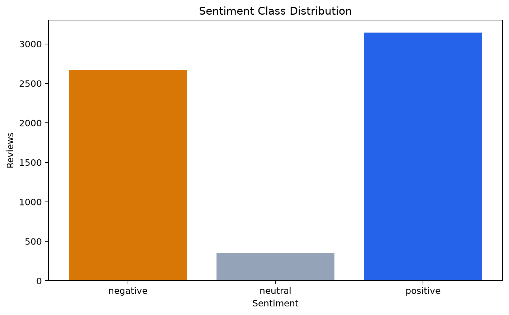
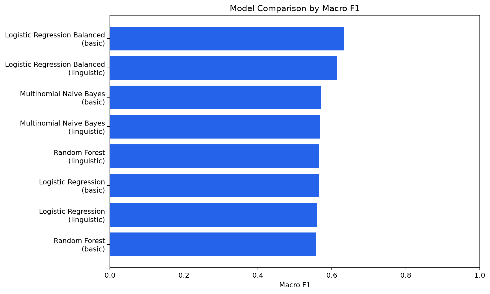
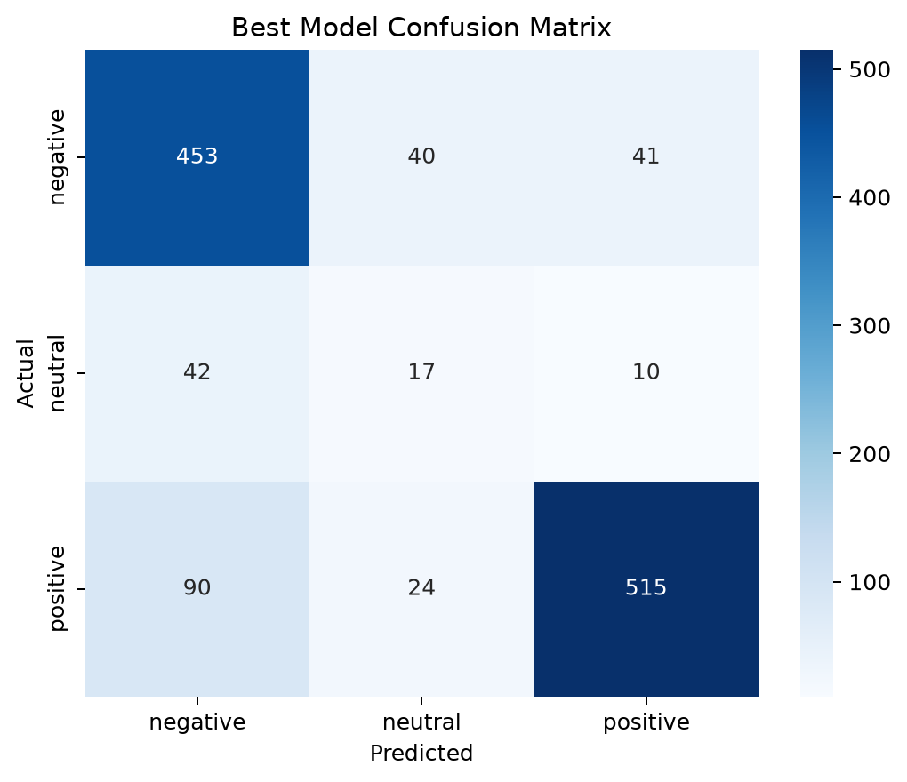
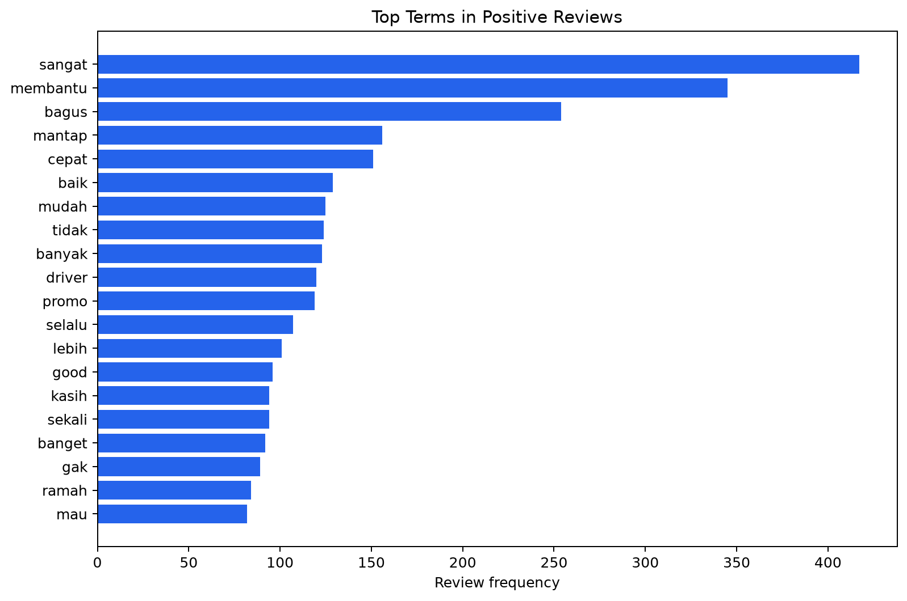
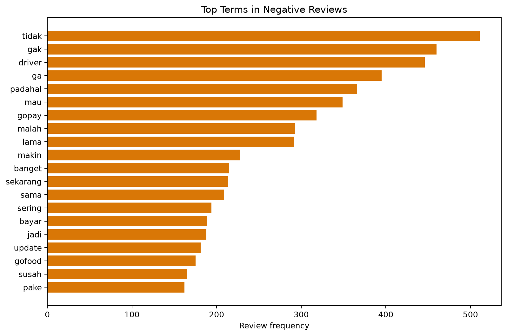
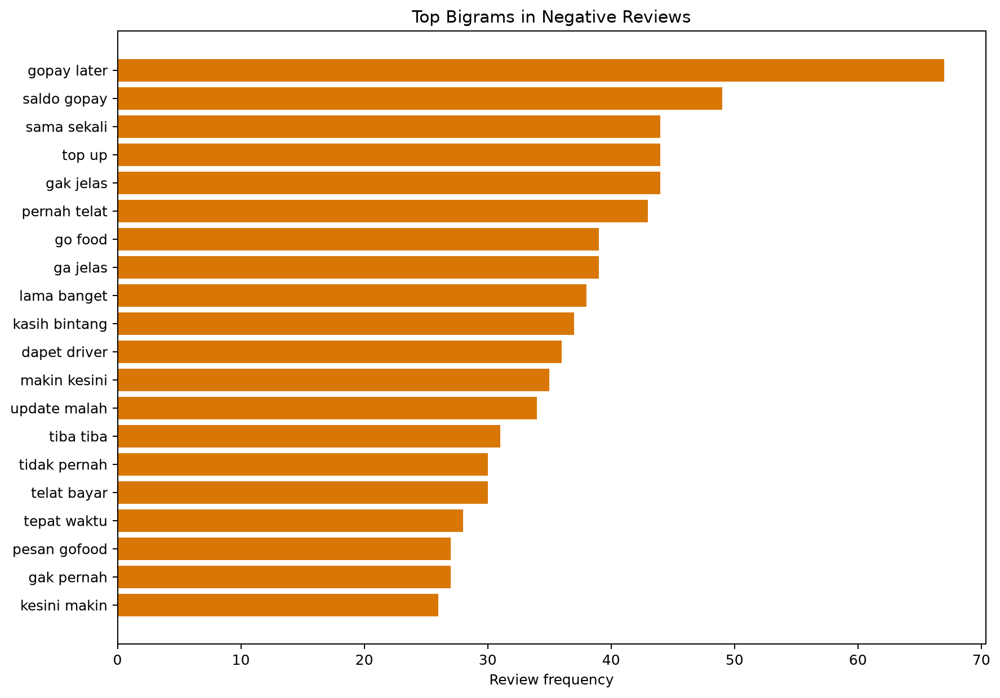

# Gojek Review Insight

Gojek Review Insight analyzes Indonesian-language Gojek app reviews, classifies them as negative, neutral, or positive, compares baseline machine-learning models, identifies recurring complaint themes, and converts the resulting evidence into cautious product-oriented insights. The repository prioritizes reproducibility and methodological transparency rather than claiming production readiness.

## Project Overview

App stores contain direct feedback about reliability, payments, pricing, drivers, promotions, and other parts of the customer experience. Reading thousands of reviews manually is slow, while relying only on star averages hides the language behind those ratings.

This project provides a reproducible Python workflow that validates and cleans review data, derives transparent rating-based sentiment labels, compares TF-IDF classifiers, evaluates class-level performance, exports prediction errors, and groups negative reviews into explainable complaint categories. A local Streamlit app demonstrates inference with the exact fitted pipeline.

Install the environment and regenerate every output with:

```bash
python -m venv .venv
pip install -r requirements.txt
python -m src.sentiment_pipeline
```

## Objectives

- Classify reviews into negative, neutral, and positive sentiment categories.
- Compare interpretable baseline machine-learning models on one shared split.
- Evaluate performance beyond accuracy using macro and weighted metrics.
- Identify recurring themes in rating-derived negative reviews.
- Analyze prediction errors and difficult language patterns.
- Produce evidence-based, appropriately caveated product recommendations.

## Key Results

| Item | Verified result |
|---|---|
| Raw dataset | 225,002 reviews |
| Usable reviews | 6,162 reviews after version filtering and validation |
| Sentiment classes | 2,668 negative; 349 neutral; 3,145 positive |
| Train / test rows | 4,930 / 1,232 |
| Best model | Logistic Regression with `class_weight="balanced"` |
| Selected preprocessing | Basic cleaning without stemming |
| Test macro F1 | **0.6327** |
| Test weighted F1 | **0.8037** |
| Hardest class | Neutral, F1 **0.2267** |
| Most frequent matched complaint theme | Payment problems: 576 reviews, 21.59% of negative reviews |
| Normalized-text overlap across split | 0 |

These results describe one fixed, grouped holdout split. They are not estimates of production performance.

## Dataset

The repository uses the Kaggle dataset [Gojek App Reviews Bahasa Indonesia](https://www.kaggle.com/datasets/ucupsedaya/gojek-app-reviews-bahasa-indonesia). The committed raw CSV contains 225,002 rows with the following source columns:

- `userName`
- `content`
- `score`
- `at`
- `appVersion`

The primary workflow:

- removes missing or blank review text;
- filters the reference scope to app versions beginning with `4.8`;
- removes exact duplicate review text;
- removes normalized-text groups carrying conflicting sentiment labels;
- preserves rating, timestamp, app-version, and other available metadata;
- excludes rating and sentiment fields from model features.

The final modeling dataset contains 6,162 reviews. Labels are generated from the original rating:

- Ratings 1-2: **negative**
- Rating 3: **neutral**
- Ratings 4-5: **positive**

This rule is transparent and reproducible, but ratings are only proxy labels. Review wording can disagree with the selected rating, creating unavoidable noisy-label risk.

| Sentiment | Reviews | Percentage |
|---|---:|---:|
| Negative | 2,668 | 43.30% |
| Neutral | 349 | 5.66% |
| Positive | 3,145 | 51.04% |
| **Total** | **6,162** | **100.00%** |



## Methodology

1. **Data validation**  locate the local CSV and validate review and target-source columns.
2. **Review cleaning**  remove invalid text, exact duplicates, empty normalized text, and conflicting normalized-label groups.
3. **Label generation**  map ratings 1-2, 3, and 4-5 to negative, neutral, and positive.
4. **Text preprocessing**  compare basic cleaning with negation-safe stopword handling and selective stemming.
5. **Grouped split**  use a fixed, stratified 80/20 split grouped by normalized review text.
6. **Feature extraction**  fit unigram and bigram TF-IDF inside each Scikit-learn pipeline.
7. **Model comparison**  train four classifiers on the same split.
8. **Evaluation**  calculate accuracy, macro metrics, weighted metrics, per-class metrics, reports, and confusion matrices.
9. **Error analysis**  export misclassified reviews, confidence, error direction, and diagnostic language flags.
10. **Complaint categorization**  apply documented keyword rules to rating-derived negative reviews.
11. **Business interpretation**  generate findings and recommendations directly from saved outputs.

All learned transformations are fitted on training data. The saved artifact accepts raw review text and contains preprocessing, TF-IDF, and the selected classifier.

## Indonesian Text Preprocessing

The basic configuration applies:

- lowercasing;
- URL and mention removal;
- hashtag-marker removal while retaining hashtag content;
- repeated-character normalization;
- safe punctuation and whitespace cleanup;
- a small documented Indonesian slang mapping.

Negation is intentionally preserved. Words such as `tidak`, `tak`, `bukan`, `belum`, `jangan`, `gak`, `ga`, `nggak`, and `enggak` are not removed.

The linguistic experiment additionally applies negation-safe Indonesian stopword removal and selective Sastrawi stemming. Its stemming vocabulary is learned only from training tokens occurring at least five times.

The best basic-cleaning model achieved macro F1 **0.6327**, compared with **0.6144** for the best linguistic/stemming model. The final pipeline therefore retains the simpler basic configuration; stemming was tested rather than assumed to be beneficial.

## Models

The comparison includes:

- **Multinomial Naive Bayes** as a conventional sparse-text baseline.
- **Logistic Regression** as a linear classifier suited to TF-IDF features.
- **Balanced Logistic Regression** to reduce the influence of class imbalance during training.
- **Random Forest** as a non-linear comparison, with the limitation that tree ensembles are generally less natural for high-dimensional sparse text.

The purpose of the comparison is to establish defensible baselines, not to imply that model quantity alone improves the analysis.

## Model Evaluation

Accuracy can obscure poor minority-class performance. The primary selection metric is therefore **macro F1**, which gives each sentiment class equal weight. Weighted F1 is reported as additional context.

| Model | Preprocessing | Accuracy | Macro precision | Macro recall | Macro F1 | Weighted F1 |
|---|---|---:|---:|---:|---:|---:|
| **Logistic Regression Balanced** | **Basic** | **0.7995** | **0.6314** | **0.6378** | **0.6327** | **0.8037** |
| Logistic Regression Balanced | Linguistic | 0.7865 | 0.6134 | 0.6204 | 0.6144 | 0.7927 |
| Multinomial Naive Bayes | Basic | 0.8304 | 0.5585 | 0.5896 | 0.5696 | 0.8079 |
| Multinomial Naive Bayes | Linguistic | 0.8271 | 0.5561 | 0.5874 | 0.5673 | 0.8045 |
| Random Forest | Linguistic | 0.7995 | 0.5913 | 0.5754 | 0.5663 | 0.7829 |
| Logistic Regression | Basic | 0.8231 | 0.5492 | 0.5823 | 0.5643 | 0.8004 |
| Logistic Regression | Linguistic | 0.8157 | 0.5452 | 0.5776 | 0.5596 | 0.7936 |
| Random Forest | Basic | 0.7987 | 0.5914 | 0.5697 | 0.5571 | 0.7795 |

Balanced Logistic Regression was selected because it produced the highest macro F1, not the highest accuracy. The selected model reached F1 scores of **0.8097** for negative, **0.2267** for neutral, and **0.8619** for positive reviews. Class weighting improved the balance across classes, but neutral performance remains weak because neutral examples are scarce and rating-based neutral language is ambiguous.



## Confusion Matrix



The model correctly classified 453 of 534 negative reviews, 17 of 69 neutral reviews, and 515 of 629 positive reviews. Neutral reviews were most often predicted as negative: 42 of the 69 neutral test reviews followed this pattern. Positive-to-negative was the most frequent overall error direction, with 90 cases.

## Sentiment-Specific Terms

The fitted linear model associates terms such as `buruk`, `lama`, `parah`, `ga`, and `tidak` with the negative class, while `mantap`, `membantu`, `cepat`, `ramah`, and `bagus` are among the strongest positive associations. These are predictive associations, not causal explanations of customer behavior.







## Complaint Theme Analysis

The project uses **explainable complaint-theme categorization**, not topic modeling. Rating-derived negative reviews are filtered, frequent unigrams and bigrams are examined, and documented keyword rules assign reviews to interpretable categories. A review is counted at most once within a category but may match multiple categories. Representative review examples are retained in the generated CSV for review.

| Theme | Review count | Percentage of negative reviews | Representative keywords |
|---|---:|---:|---|
| Other / uncategorized | 1,113 | 41.72% |  |
| Payment problems | 576 | 21.59% | gopay, bayar, pembayaran, saldo, transfer |
| Driver availability | 448 | 16.79% | driver, pengemudi, cari driver |
| Pricing | 231 | 8.66% | mahal, harga, tarif, ongkir, biaya |
| Application errors | 226 | 8.47% | error, bug, lemot, lag, server |
| Account and login | 140 | 5.25% | login, akun, OTP, verifikasi |
| Customer service | 138 | 5.17% | customer service, CS, komplain, bantuan |
| Promotions and vouchers | 138 | 5.17% | promo, voucher, diskon, cashback |
| GPS or map issues | 103 | 3.86% | GPS, maps, lokasi, titik jemput |
| Cancellation | 93 | 3.49% | cancel, batal, pembatalan |

The 41.72% uncategorized share is intentionally visible. It shows that the current rules do not cover the full diversity of negative feedback and should be extended only after manual review.

## Key Product Findings

### Finding 1  Payment-related complaints are the largest matched category

**Evidence:**
Payment keywords matched 576 negative reviews, or 21.59% of all rating-derived negative reviews.

**Interpretation:**
This suggests recurring friction around payment, balance, transfer, or top-up experiences. Keyword matching does not establish which specific payment flow caused each complaint.

**Recommendation:**
Sample and manually label the matched reviews by payment journey, then compare failure reasons across payment, balance deduction, transfer, and top-up flows before prioritizing fixes.

### Finding 2  Driver availability is another prominent complaint signal

**Evidence:**
Driver-availability rules matched 448 negative reviews, or 16.79%.

**Interpretation:**
The volume may reflect difficulty finding a driver or broader dissatisfaction involving drivers; the current rules cannot reliably separate availability from behavior or service quality.

**Recommendation:**
Refine the category into availability, cancellation, conduct, and matching subtypes, then inspect differences by time and location if privacy-safe metadata becomes available.

### Finding 3  The complaint taxonomy has substantial uncovered feedback

**Evidence:**
1,113 negative reviews, or 41.72%, did not match any current category.

**Interpretation:**
The uncategorized share indicates that a small keyword taxonomy cannot represent all user concerns and that forcing every review into a predefined category would be misleading.

**Recommendation:**
Manually review a stratified sample of uncategorized reviews and add a category only when a coherent, recurring pattern is supported by evidence.

### Finding 4  Neutral sentiment remains difficult to identify

**Evidence:**
Neutral-class F1 was 0.2267. Only 17 of 69 neutral test reviews were correctly classified; 42 were predicted as negative.

**Interpretation:**
The small neutral class and rating-derived labels may combine factual, mixed, and weakly opinionated language under one label.

**Recommendation:**
Prioritize manual label validation for three-star reviews before adding model complexity. Consider a binary polarity scope only if neutral classification is not required by the product question.

## Error Analysis

Errors were reviewed programmatically and exported with confidence scores, error direction, rating, and heuristic flags. The flags support investigation but are not human-confirmed causes.

- 247 of 1,232 test reviews were misclassified (20.05%).
- 99 errors contained preserved negation.
- 45 contained mixed-sentiment markers such as but or however.
- 28 contained mapped slang forms.
- 26 were very short.
- 24 contained repeated characters.
- The most frequent direction was **positive predicted as negative**, with 90 cases.

Typical patterns include a positive rating paired with complaint language, a mixed review that combines appreciation and a service problem, and short slang-heavy text with little context. These descriptions are paraphrased to avoid exposing reviewer information. Sarcasm and spelling variation may also matter, but they were not reliably measured by the current automated flags.

## Streamlit Demo

> A local Streamlit demo is included in the repository.

The app provides:

- single-review sentiment prediction;
- prediction confidence and class probabilities;
- selected-model metadata and comparison metrics;
- the generated class-distribution figure;
- the complaint-theme summary;
- clear missing-artifact and empty-input handling.

Generate the trained artifact first, then start the app:

```bash
python -m src.sentiment_pipeline
streamlit run streamlit_app.py
```

The app loads `models/best_sentiment_pipeline.joblib` and does not retrain on startup. It is a local portfolio demonstration, not an authoritative sentiment service or public deployment.

## Project Structure

```text
Gojek-Review-Insight/
|-- data/
|   |-- raw/
|   `-- processed/
|-- models/
|   |-- best_sentiment_pipeline.joblib
|   `-- best_sentiment_pipeline.metadata.json
|-- notebook/
|-- output/
|   |-- figures/
|   |-- metrics/
|   `-- insights/
|-- src/
|   |-- data.py
|   |-- preprocessing.py
|   |-- training.py
|   |-- reporting.py
|   |-- themes.py
|   |-- inference.py
|   `-- sentiment_pipeline.py
|-- tests/
|-- streamlit_app.py
|-- requirements.txt
`-- README.md
```

The Python module `src.sentiment_pipeline` is the primary workflow. Notebooks are optional walkthrough or historical analysis material.
